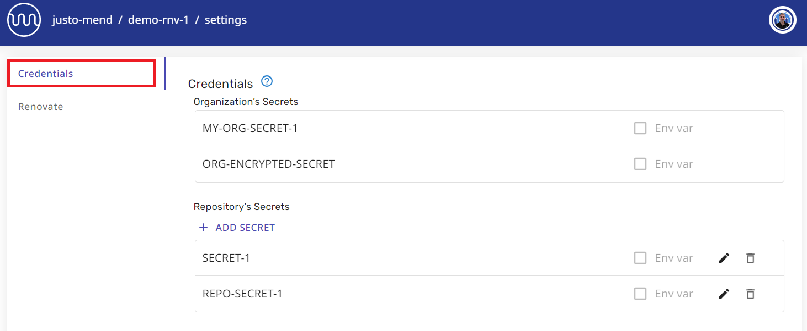

# Using secrets with Mend cloud Apps

The information on this page is for the Mend-hosted cloud apps:

- Renovate App on GitHub
- Mend App on Bitbucket

If you self-host, you can skip reading this page.

## :warning: Migrate secrets in your Renovate config file :warning:

The Mend-hosted cloud app will stop reading secrets from the Renovate config file in your repository on 01-Oct-2024.
You must migrate any secrets you currently keep in the Renovate config file, and put them in the app settings page on [developer.mend.io](https://developer.mend.io).
To add secrets you must have admin-level rights.

Read [Migrating encrypted secrets from Repo Config to App Settings](migrating-secrets.md) to learn more.

## Managing secrets for the Mend-hosted cloud apps

This section explains how you manage secrets for the Mend-hosted cloud apps.
If you self-host you do not need this section.

### Adding a secret

To add a secret for the Mend cloud app:

1. Go to the web UI at [developer.mend.io](https://developer.mend.io).
2. Open your organization/repository settings.
3. Put the secret in the _Credentials_ section:

   

4. Use can reference the secret from Renovate config files inside the repo.
Alternatively, you can use the Host Rules UI (see below).

   ```json
   {
     "hostRules": [
       {
         "matchHost": "github.com",
         "token": "{{ secrets.MY_ORG_SECRET }}"
       }
     ]
   }
   ```

### Adding a host rule

1. Open the _Credentials_ section of the settings page for the relevant Org or Repo.
2. Select `ADD HOST RULE` to open the "Add a Host Rule" dialog box.

   

3. Fill out the details for your host rule.

   Note: You can select a pre-defined host rule type in the `Select Host Type` field, or provide a specific value in the `HostURL` field.
   You do not need to provide both values.

   

## Organization secrets vs repository secrets

### Secret scope

Secrets can be scoped to your organization _or_ to your repository:

| Secret scoped to your | What will happen?                                              |
| --------------------- | -------------------------------------------------------------- |
| Organization          | Secrets are inherited by all repositories in your organization |
| Repository            | Secrets are referenced by that repository only                 |

### Make changes on the right page

The web UI has _two_ settings pages.
One page is for the organization, and the other page is for the repository.

Make sure you're making the changes on the right page!

### Example


The screenshot shows inherited organization secrets and specific repository secrets.

### Managing organization-level secrets

The **Installed Repositories** table means you are on your organization's page.
Select the _Settings_ button to manage your organization secrets:


### Managing repository-level secrets

The **Recent jobs** table means you are on your repository's page.
Select the _Settings_ button to manage your repository secrets:


